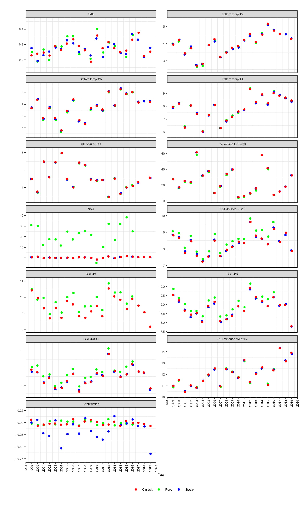
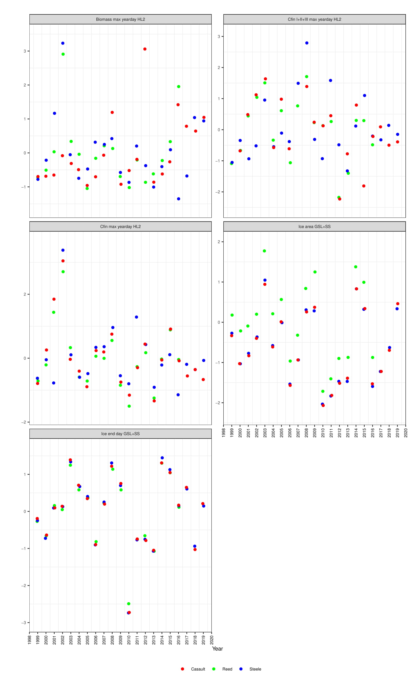
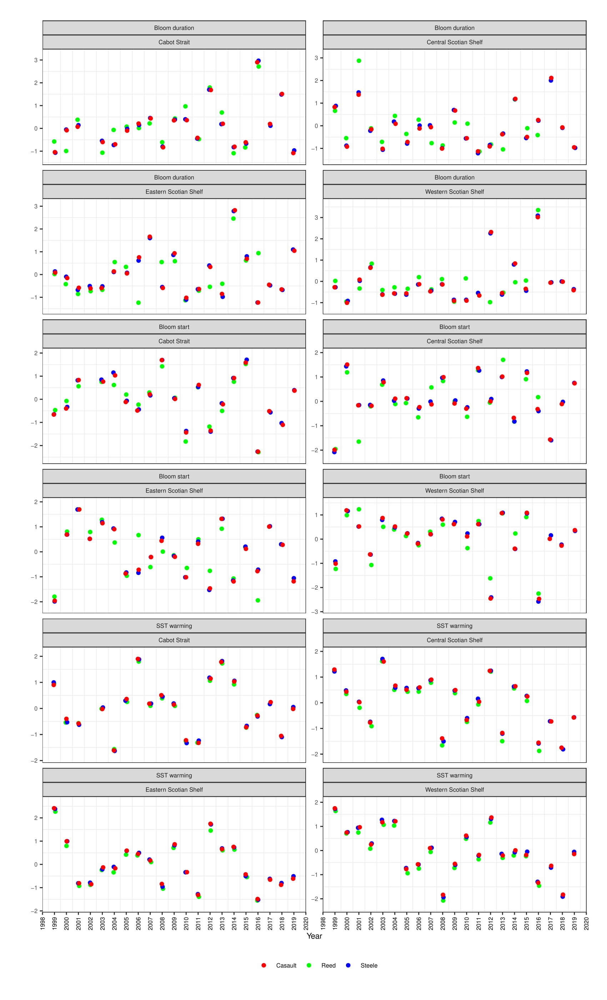
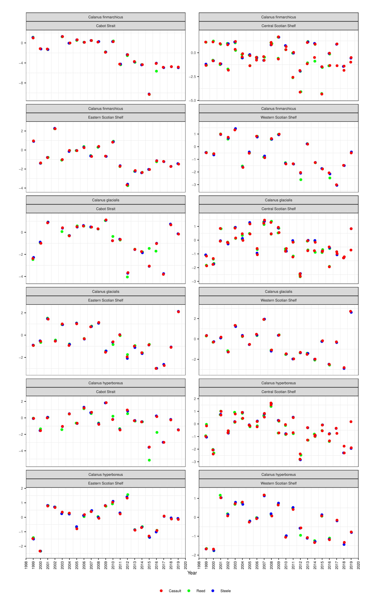
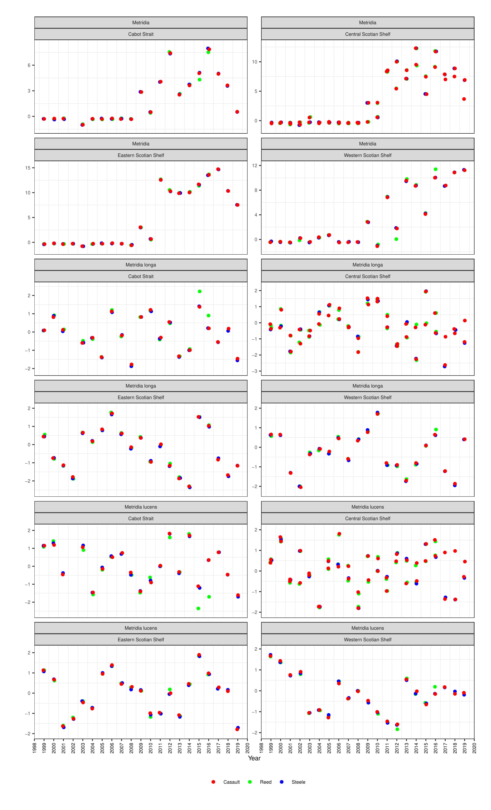
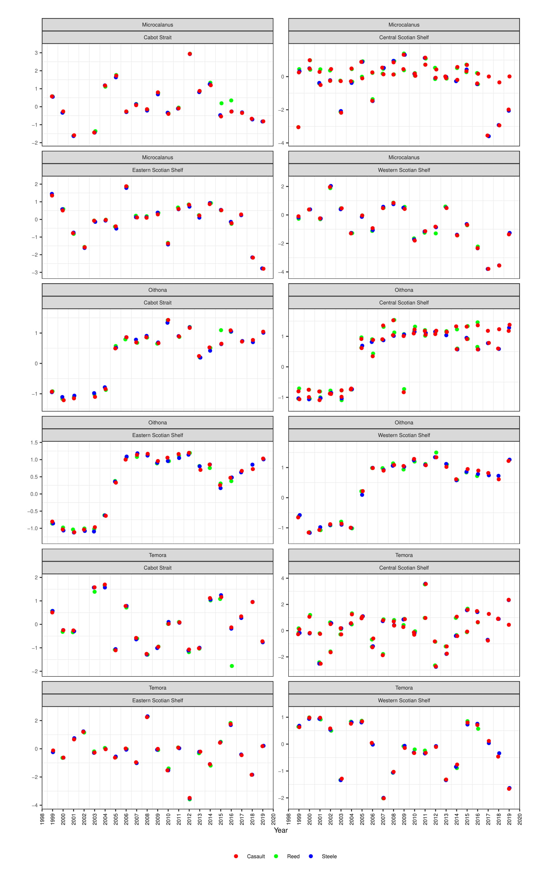
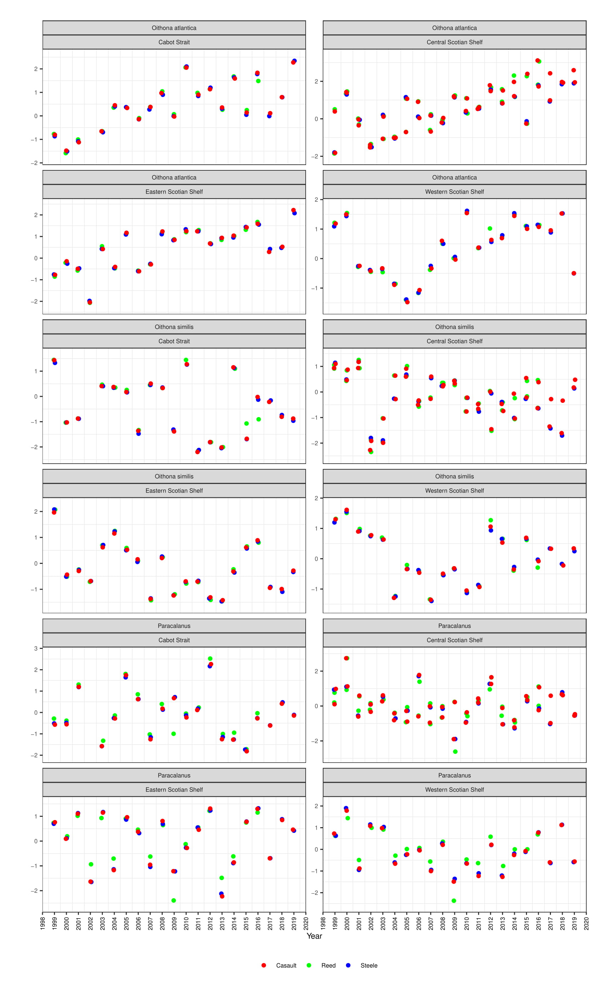
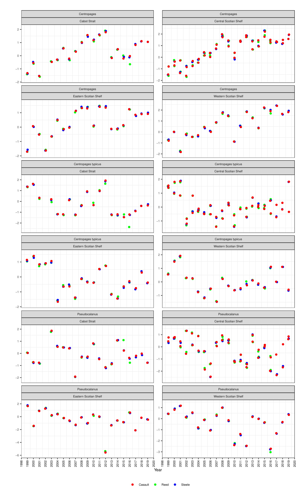
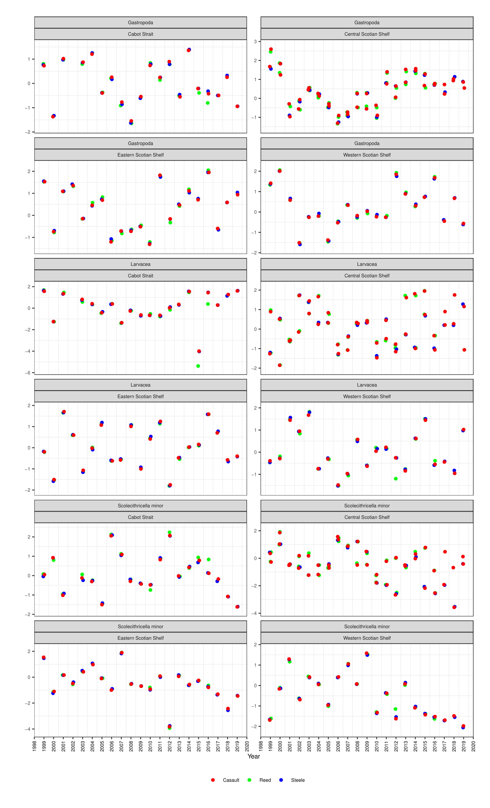
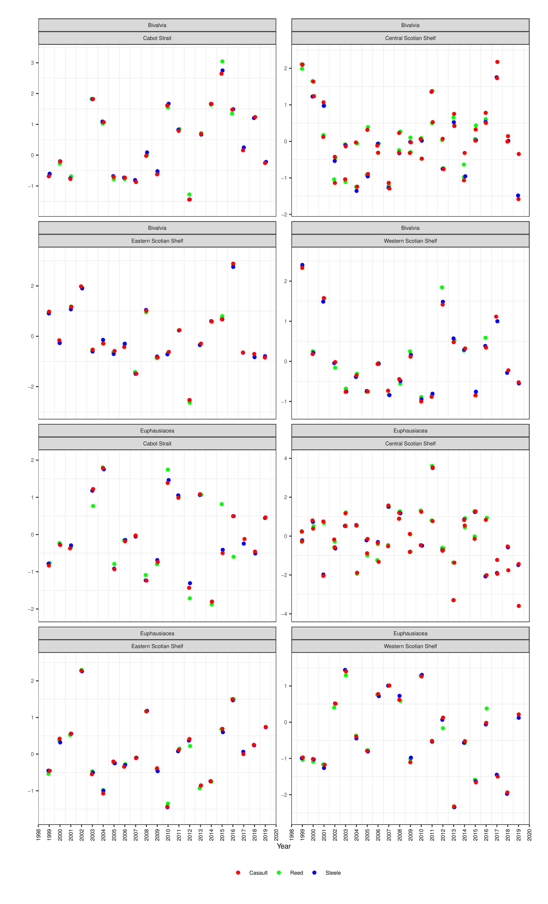

# Multivariate analysis review

## Attendance: Catherine Johnson, Benoit Casault, Emily Chisholm

### Meeting minutes

* __EC will take notes from today and from BC's email (May 12) and incorporate them into Reid's methodology document__
  * Some structural reorganization will be done
  * Draft will be reviewed by CJ and BC
  
* __EC and BC will work to update this gitHub repo to include the latest versions of all scripts and data__

* Each metric has now been calculated 3 times, once by Dan Reed, then by Reid Steele, then by BC
* BC plotted a comparison of all 3 outputs for comparison
* __Plots will be updated to remove jitter, plotting different users with low opacity shapes to distinguish with precision (BC)__

* Group went over each plot individually to identify issues

### Physical Variables

* AMO
    * DR had used annual values
    * RS and BC used monthly values
    * All three outputs appear to have significant differences
    * __EC will investigate differences using other sources for AMO (literature, SART, Res Docs) - BC will send data to facillitate__

* Bottom temp 4V includes both 4Vs and 4Vn

* Ice volume
    * BC and RS used updated data source
    * Some small differences between DR older data
    * will maintain newer data set moving forward
  
* NAO
    * DR used data from Roger Pettipas (pressure)
    * RS and BC used Peter Galbraith's anomoly data
    * difference in scales makes plot difficult to interpret
    * __EC will create scatter plot to compare relationship, eg interannual variability, to ensure data is similar despite scale__
    
* SST
    * difference in data sources between DR and BC/RS
    * RS and BC used Peter Galbraith's reprocessed data 
    * RS combined 4Vs and 4Vn
    * BC used only 4Vs
    * DR analysis was performed before 4V s/n distinction
    * moving forward will use 4Vs
  
* stratification
    * RS used only HL2 data (error)
    * BC and DR used all SS data
    * EC will ensure all SS data is incorporated in package
    
* Bottom temperature note
    * 4V and 4W have no 2018 data
    * RS interpolated on BC recommendation using 4X scale value
    * __EC will investigate whether this is necessary in PCA__
    * __CJ will consider best interpolation scheme__
    * Incorporate note in future versions of analysis to ensure readers are aware of interpolation
    

### Phenology Variables

* Zooplankton peaks
    * BC could not find DR code
    * BC followed methods presented in paper (PCA -> LOESS fit)
    * DR performed a sepearte analysis (PCA) on Calanus stages to get exact timing
    * __CJ will look back on DR code for stage abundance PCA__
    
* BioMass Max
    * RS method is wrong, uses abundance not biomass
    * This requires more investigation to confirm
    
* Cfin I + II + III
    * good agreement between DR and BC
    * BC had bug with 1999 and 2007 values to be resolved
    
* Cfin HL2
    * agreement between DR and BC
    
* Note:
  * Dan cleaned up a lot of scripts before leaving, he may have left out some interim steps and data products
  * Ideally would use original DR code, but some cases where BC had to rewrite might be necessary
  * __CJ will investigate and look for original code__
  * If it can not be found may require follow up with DR
  
* Ice Area
    * BC and RS used new data provided by Peter Galbraith
    * DR used data from Roger Pettipas
    * will maintain new data source (PG)
    
* Ice end day
    * All OK
    
* Bloom parameters
    * some reprocessing of data may have been done in between DR analysis and BC/RS analysis
    * BC will check and follwo up
    * some differences in anomoly calculations between BC and DR
    * may be due to DR lack of reference period in calculations
    

* SST warming
    * All OK
    * small differences from DR due to processing
    
    
    
### Zooplankton variables

* Mostly good agreement between all sources due to least amount of data reprocessing/ adjustment

* Differences in CSS
  * Dr and BC used distinct vars for HL and HL2
  * RS did not use any distinction
  * __EC will investigate how this is handled in PCA to ensure consistency__
  
* Metridia
  * Some small differences due to data correction
  * note that pre 2008 'Metridia' maintains zero value, this is likely due to identification methods
  * __EC will investigate if Metridia (without species designation) is included in PCA__
    * similar issue in Oithona and centropages, less extreme
    * CJ will also investigate raw data
    
* Reference period
  * __BC will double check that the same reference period was used throughout (should be 1999-2015)__
  

